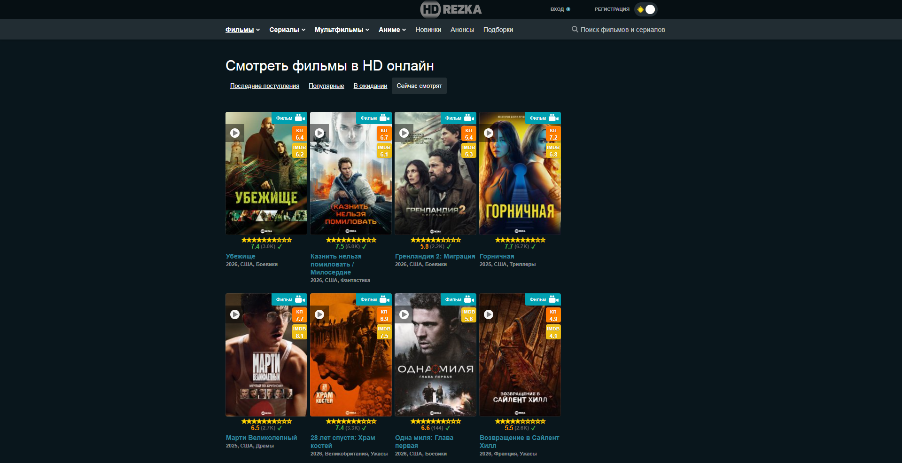
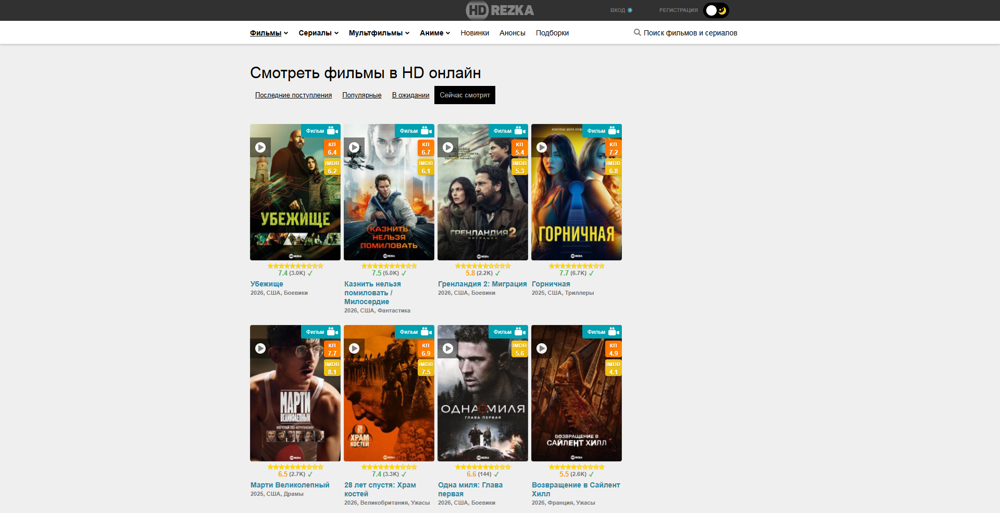
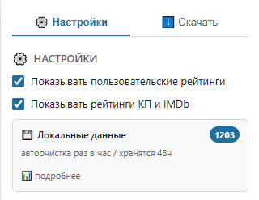
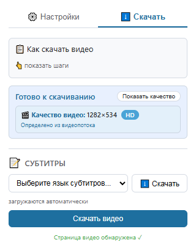

# HDrezka Ratings + Downloader

> Удобное расширение для браузера, которое показывает рейтинги (Кинопоиск, IMDb, HDrezka) и позволяет скачивать видео и субтитры с сайта HDrezka.

## ✨ Возможности

*   **⭐ Рейтинги:** Отображает пользовательские рейтинги HDrezka, а также рейтинги Кинопоиска и IMDb прямо на карточках фильмов и сериалов.
*   **⬇️ Скачивание видео:** Позволяет скачивать видео с открытой страницы в один клик (доступно при работающем плеере).
*   **📝 Субтитры:** Автоматически находит и предлагает скачать доступные субтитры к видео.
*   **🚀 Умный кэш:** Все данные рейтингов кэшируются на 48 часов для мгновенной загрузки и снижения нагрузки на сайт.
*   **🎨 Минималистичный дизайн:** Ненавязчиво встраивается в интерфейс сайта.

## 📸 Скриншоты

| Рейтинги на карточке | Интерфейс расширения |
|:---:|:---:|
|  |  |

| Настройки | Скачивание видео и субтитров |
|:---:|:---:|
|  | |

## 🛠 Установка

### Из магазина расширений
*   **Microsoft Edge:** [Ссылка на страницу расширения в Edge Add-ons] (добавите после публикации)
*   **Chrome Web Store:** [Ссылка на страницу в Chrome Web Store] (если планируете)

### Вручную (режим разработчика)
1.  Скачайте архив с последней версией из [релизов](ссылка на раздел Releases).
2.  Распакуйте архив в отдельную папку.
3.  Откройте браузер и перейдите на страницу управления расширениями (`chrome://extensions/` или `edge://extensions/`).
4.  Включите **«Режим разработчика»**.
5.  Нажмите кнопку **«Загрузить распакованное расширение»** и укажите путь к распакованной папке.

## 🧰 Как использовать

1.  Перейдите на сайт HDrezka и откройте любую страницу со списком фильмов.
2.  На карточках автоматически появятся рейтинги.
3.  Чтобы скачать видео или субтитры:
    *   Откройте страницу фильма и запустите плеер.
    *   Нажмите на иконку расширения в панели браузера.
    *   Перейдите на вкладку **«Скачать»**.
    *   Выберите качество (если доступно) и язык субтитров, затем нажмите кнопку скачивания.

## 📄 Политика конфиденциальности

Мы серьезно относимся к вашей приватности. Все данные обрабатываются локально и не передаются на сторонние серверы.
👉 [Ознакомиться с полной политикой](https://oopsby.github.io/HDrezka/privacy.html)

## 🤝 Обратная связь и поддержка

Если вы нашли ошибку или у вас есть предложение по улучшению, пожалуйста, создайте **Issue** в этом репозитории или напишите на email: [send2icq@gmail.com](mailto:send2icq@gmail.com)

## ⚖️ Лицензия

Проект распространяется под лицензией MIT. Подробнее — в файле [LICENSE](LICENSE).
